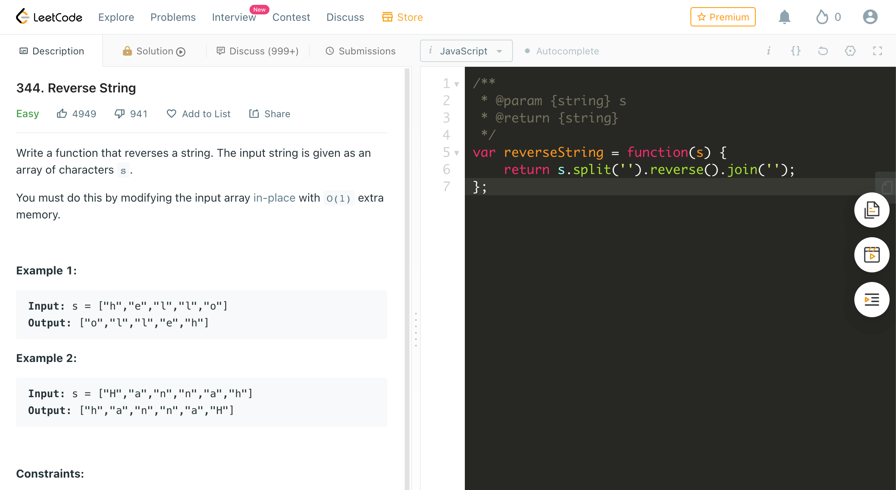

# Leetcode Helper

A chrome extension helps you have fun at [leetcode.com](https://leetcode.com) and [leetcode-cn.com](https://leetcode-cn.com).

[https://chrome.google.com/webstore/detail/leetcode-helper/gleoepapfjkpcijfmchfabbnldejdnoj](https://chrome.google.com/webstore/detail/leetcode-helper/gleoepapfjkpcijfmchfabbnldejdnoj)

## Features

Unfortunately, there is only one feature for now.

- Copy question content for markdown

Question page:



Then, you could click the `Copy the question` button to copy markdown text to clipboard.

The result for markdown:

```markdown
### [344\. Reverse String](https://leetcode.com/problems/reverse-string/description/)

Difficulty: **Easy**

Write a function that takes a string as input and returns the string reversed.

**Example:**  
Given s = "hello", return "olleh".

#### My Solution

/```
/**
 * @param {string} s
 * @return {string}
 */
var reverseString = function(s) {
    return s.split('').reverse().join('')
};
/```
```

## installation

### Chrome webstore

[https://chrome.google.com/webstore/detail/leetcode-helper/gleoepapfjkpcijfmchfabbnldejdnoj](https://chrome.google.com/webstore/detail/leetcode-helper/gleoepapfjkpcijfmchfabbnldejdnoj)


### Manual

- Clone or download this project to local.
- Open `chrome://extensions/` in your chrome
- Drag the project folder to the browser.

Then, open a problem page in leetcode, you would see the button.
